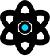
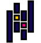

# ¡Hola a Todos! 👋

Mi nombre es Ricardo Sánchez y soy Programador Web y Analista de Datos. Desde muy joven, siempre tuve un gran interés por el mundo de la programación y el desarrollo de software; por lo que a los quince años, en 2018, decidí aprender por mi cuenta C# para crear mis propios videojuegos utilizado Unity. Aunque no logré crear uno por tener ideas muy ambiciosas, durante ese tiempo aprendí mucho sobre programación: con el tiempo decidí estudiar tencologías del deasrrollo web, como HTML, CSS, MYSQL, Javascript, PHP..., y cuando comencé la universidad en 2022, decidí abrirme camino en el mundo del Análisis de Datos.

Actualmente estoy estudiando Ingienería en Informática y tengo conocimientos para el desarrollo web, especialmente del lado del frontend, y para el Análisis de Datos.

  
  
  
  
  

### Algunos Datos Extras sobre mí

- ☕ Programo de lunes a lunes y nunca falta una buena taza de Café!
- 🧮 Me encanta la matemática y la estadística, y por eso me encanta el análisis de datos!
- 💻 Los principios SOLID y Clean Code nunca faltan cuando programo!
- 🤖 Entre tantas que cosas que he estudiado, mi favorita sin duda ha sido el Machine Learning!

 

## ⚒️ Skillset

Desde que comencé he probado una gran variedad de lenguajes y tecnologías, y estas son con las más me gusta trabajar y me identifico:

### Frontend

  &nbsp;
  &nbsp;
  &nbsp;
  &nbsp;
  
  
  
  
  
  &nbsp;
  
  
  &nbsp;&nbsp;
  &nbsp;
  &nbsp;
  &nbsp;
  &nbsp;
  &nbsp;

### Backend

  &nbsp;
  &nbsp;
  &nbsp;
  &nbsp;
  &nbsp;
  &nbsp;
  &nbsp;
  &nbsp;
  &nbsp;
  &nbsp;

### Análisis de Datos

  &nbsp;
  &nbsp;
  &nbsp;
  &nbsp;
  &nbsp;
  &nbsp;
  &nbsp;
  &nbsp;
  &nbsp;
  &nbsp;
  &nbsp;
  &nbsp;
  &nbsp;
  

 

**_Nota: Los iconos son adaptaciones hechas por mí, y se encuentran disponibles en el siguiente [repositorio.](https://github.com/Rickhersd/neo-icons) Adelante si quieres usarlos, pero no olvides dejar una estrellita_** 😉
